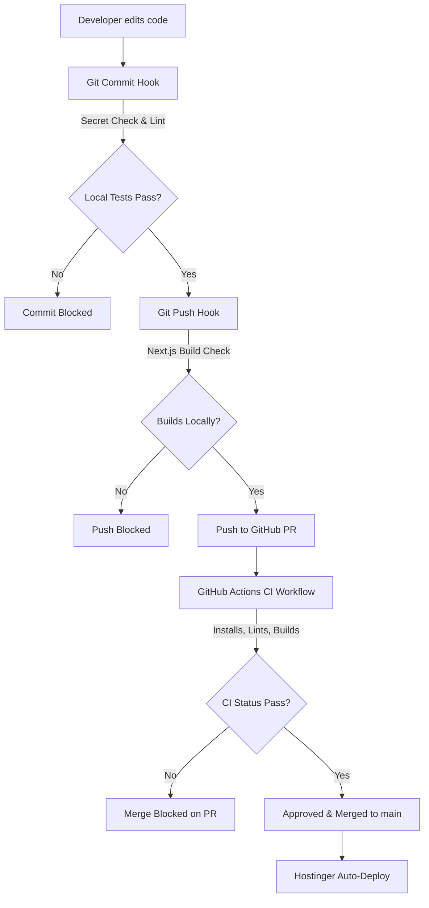

# Implementation Plan - CI/CD Pipeline & Code Security Guard

This plan outlines the setup of a robust CI/CD pipeline and local pre-commit/pre-push guardrails to ensure that no code containing linter errors, build failures, typescript compiler issues, or exposed secrets/credentials gets pushed to GitHub or auto-deployed to Hostinger.

## Proposed Architecture

We will implement a multi-layered guardrail:

---

## User Review Required

> [!IMPORTANT]
> **Branch Protection Rules on GitHub**
> A CI pipeline is only effective if developers are prevented from pushing directly to the `main` branch. After we set up the pipeline, you **MUST** configure your GitHub repository settings:
> 1. Go to your repository on GitHub -> **Settings** -> **Branches**.
> 2. Add a branch protection rule for `main` (or `master`).
> 3. Check **"Require a pull request before merging"**.
> 4. Check **"Require status checks to pass before merging"** and select our `CI / Verification` check.
> 5. Check **"Do not allow bypassing the above settings"** (so even admins can't accidentally push broken code).

---

## Proposed Changes

We will introduce the following files and configurations:

### 1. GitHub CI Workflow
We will create a GitHub Actions workflow to run on every Pull Request and Push to any branch.

#### [NEW] [verify.yml](file:///c:/Users/REALHUBB%20VENTURES/OneDrive/Desktop/realhubb-next-website/.github/workflows/verify.yml)
* Defines the CI pipeline:
  * Check out code.
  * Install dependencies using `npm ci` (clean install matching `package-lock.json`).
  * Run `npm run lint` (ESLint code quality checks).
  * Run TypeScript type-checking (`npx tsc --noEmit`).
  * Run `npm run build` (Next.js production compiler test).

### 2. Local Git Hooks (Husky & lint-staged)
We will install Husky and lint-staged to run local hooks before commits and pushes.

#### [MODIFY] [package.json](file:///c:/Users/REALHUBB%20VENTURES/OneDrive/Desktop/realhubb-next-website/package.json)
* Add `lint-staged` configuration.
* Add developer scripts for pre-commit linting and type-checking.

#### [NEW] [.husky/pre-commit](file:///c:/Users/REALHUBB%20VENTURES/OneDrive/Desktop/realhubb-next-website/.husky/pre-commit)
* Runs:
  1. Secret scanning script (`node scripts/scan-secrets.js`).
  2. `npx lint-staged` (lints only the modified/staged files).

#### [NEW] [.husky/pre-push](file:///c:/Users/REALHUBB%20VENTURES/OneDrive/Desktop/realhubb-next-website/.husky/pre-push)
* Runs `npm run build` and `npx tsc --noEmit` locally before any push. If the code does not build, it will block the push, saving CI runner time and preventing broken branches on GitHub.

### 3. Local Secret Scanner
We will add a lightweight Javascript scanner to check staged files for database credentials, private keys, Firebase credentials, or hardcoded secrets.

#### [NEW] [scan-secrets.js](file:///c:/Users/REALHUBB%20VENTURES/OneDrive/Desktop/realhubb-next-website/scripts/scan-secrets.js)
* Scans staged files for:
  * Hardcoded Firebase private keys or credentials.
  * MongoDB connection strings (`mongodb+srv://...`).
  * Hardcoded passwords, client secrets, or private keys (`BEGIN PRIVATE KEY`).
  * AWS/Google API keys.
* If any matching pattern is found in the staged changes, it aborts the commit.

---

## Verification Plan

### Automated Verification
* Run `node scripts/scan-secrets.js` manually to ensure it correctly scans.
* Temporarily introduce a dummy secret (e.g. `const api_key = "AIzaSyDummySecretKeyHere"`) in a file, stage it, and verify that `git commit` gets rejected.
* Temporarily introduce a syntax error, stage it, and verify that `git commit` is rejected by `lint-staged`.
* Run the local build check to make sure pre-push works.
